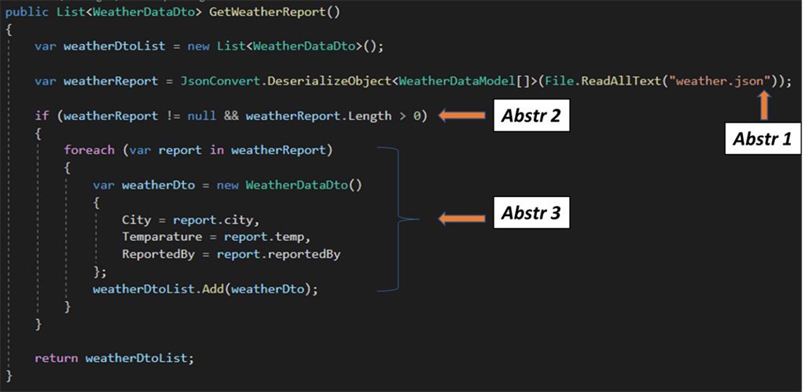
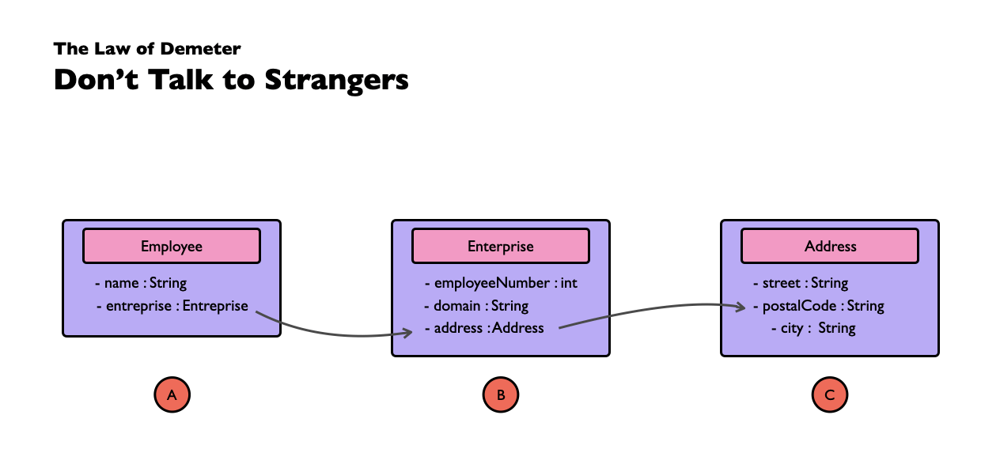

## 1: Clean Code
Clean code nghĩa là chúng ta cần tạo ra những block code:<br>
	- Hiệu quả.<br>
	- Dễ đọc, hiểu.<br>
	- Dễ thay đổi, phát triển.<br>
	- Code phải nhỏ, ngắn.<br>
	- Hạn chế xảy ra duplicate code.<br>

Code cần phải duy trì clean.
<br>`Always leave the campground cleaner than you found it.`

## 2: Meaningful Name
Tên gọi xuất hiện ở khắp mọi nơi trong phần mềm. Files, directories, variables functions, etc. Vì cần đặt tên nhiều nên ta cần phải làm nó tốt hơn.

- Dùng những tên thể hiện được mục đích: Việc chọn một cái tên tốt mất thời gian lúc ban đầu nhưng mà tiết kiệm được thời gian về sau (khi cần phải đọc lại code/ maintain). Đặt tên biến rồi sau đó phải comment mô tả mục đích của biến là một thất bại. Tên nên được đặt theo bối cảnh mà nó đang ở trong.<br>
- Dùng những tên có thể phát âm được: Tác giả có đề cập tới 1 ví dụ là `genymdhms` (Generation date, year, month, day, hour, minute and second), đặt tên như này thì khi cần trao đổi với dev khác sẽ không thể đề cập được nội dung của biến.<br>
- Dùng tên có thể tìm kiếm được: Việc thay đổi code là việc xảy ra thường xuyên vậy nên cần đặt tên thuận tiện cho việc tìm kiếm.<br>
- Tránh mã hóa: trong các project c/c++ sẽ thường xuyên gặp những trường hợp như là `p_cConstruct -> pointer cConstruct`, Hungary notation là một convention được sử dụng rất phổ biến trong các dự án cũ, thường dùng kiểu dữ liệu làm prefix cho biến. Nhưng trong các ngôn ngữ hiện đại, điều này nên tránh sử dụng vì nó làm cho code rất khó đọc.<br>
- Vì code viết ra là để lập trình viên với nhau đọc, vì vậy nên việc sử dụng thuật ngữ để đặt tên sẽ tạo nên bối cảnh tốt cho việc đọc hiểu code.<br>

## 3: Functions
- Function phải ngắn và ngắn hơn nữa.
- Function chỉ nên thực hiện 1 công việc duy nhất.
- One level of abstraction per function: đảm bảo hàm đang thực hiện duy nhất 1 việc, nếu 2 trở lên thì cần tách thành những hàm nhỏ hơn chỉ thực hiện 1 việc.
  
- Nên dựa theo "Open-closed principle": Module should be open for extension and closed for modifications.
- Stepdown Rule: Chương trình nên luôn có thể đọc hiểu được từ trên xuống như đọc 1 paragraph.
- Function argument: gần tương tự như level of abstraction, thì số lượng argument cũng nên được giới hạn: 0 (niladic, best), 1 (monoadic, OK), 2 (dyadic, OK), 3 or more (polyadic, should always be avoided)
- Ưu tiên Exception return Error code
- DRY Principle
- Structure programming: Every function should have one entry and one exit (one return, no break/continue/goto statements), ngoại lệ là những function xử lý lớn.

## 6: Object and Data Structures
- Data Abstraction: Ẩn việc triển khai không đơn giản là việc đặt một biến vào giữa các hàm, đó là vấn đề trừu tượng hóa. Một class không chỉ đơn giản là đẩy các biến của nó thông qua các getter/setter. Thay vào đó nó cung cấp các abstract interface cho phép người dùng thao tác với bản chất của dữ liệu mà không cần quan tâm đến cách chúng hoạt động.
- The law of Demeter: một module không nên biết về thành phần bên trong của một đối tượng mà nó sử dụng.
	
Theo như map này thì sẽ có 3 class:

**Employee.cs**
```cs
class Employee{
	private string name;
	private Enterprise enterprise;
}
```

**Enterprise.cs**
```cs
class Enterprise{
	private int employeeNumber;
	private string domain;
}
```

**Address.cs**
```cs
class Address{
	private string street;
	private string postalCode;
	private string city;
}
```

Trường hợp vi phạm Law of Demeter như sau:
- Khi muốn in domain của Employee, ta thực hiện như này:
```cs
	class Employee{
	private string name;
	private Enterprise enterprise;
	
	public void getDomain(){
		Console.WriteLine(enterprise.domain);
	}
}
```
Ở ví dụ này, việc in ra `domain` của `Enterprise` trực tiếp mà không từ method được cung cấp từ `Enterprise`. Vậy nên, để không vi phạm Law of Demeter trong trường hợp này thì cần phải thêm method `getDomain` từ class `Enterprise` rồi sau đó mới in ra.

```cs
class Enterprise{
	private int employeeNumber;
	private string domain;

	public string getDomain(){
		return domain;
	}
}

class Employee{
	private string name;
	private Enterprise enterprise;
	
	public void getDomain(){
		Console.WriteLine(enterprise.getDomain());
	}
}
```

- Data Transfer Objects: DTO là cấu trúc dữ liệu với public variable và không có functions. Vậy nên, DTOs thích hợp cho việc chuyển dữ liệu giữa các layers của chương trình.

## 7: Error Handling
- Use exceptions rather than return codes: trong quá khứ thì có rất nhiều ngôn ngữ không có throw exception, vì vậy nên việc error handling sẽ phải thực hiện bởi code. Hiện tại thì việc này không cần thiết nữa vì những ngông ngữ lập trình hiện đại đã hỗ trợ exception handling rồi, việc cần làm là sử dụng để code gọn, sạch và dễ đọc hơn. Ngoài ra, việc này còn đảm bảo code sẽ vẫn handle được những lỗi nếu như code handling bị thiếu case.
- Cân nhắc dùng try-catch block khi có thể, cân nhắc dùng.
- Thêm context bên trong exception message
- Không trả về Null: return null đồng nghĩa là khi cần dùng lại sẽ phải check null, việc này làm tốn effort và có khả năng gây bug, thay vào đó thì nên tạo special exception hoặc empty object(có phải check nhưng hiếm lỗi).
- Không pass Null value: như trên, pass null value vào thì đồng nghĩa là bug xuất hiện nếu không thực hiện check.

## 8: Boundaries
-  Phân biệt rõ những code mà mình không thể điều khiển ví dụ như third party libs hoặc là code chưa được implement.
-  Một số điều làm cho việc chia ranh giới code trở nên quan trọng là:
   -  Module hóa code, giúp việc test các module độc lập, dễ dàng debug, fix bug.
   -  Sử dụng interfaces hay abstract để quảng lý những code mà bạn không điều khiển.
   -  Sử dụng dependency injection để inject những dependency cần thiết vào trong code khi cần.
   -  Unit test để test ranh giới của module, ngoài ra còn đảm bảo module hoạt động đúng.